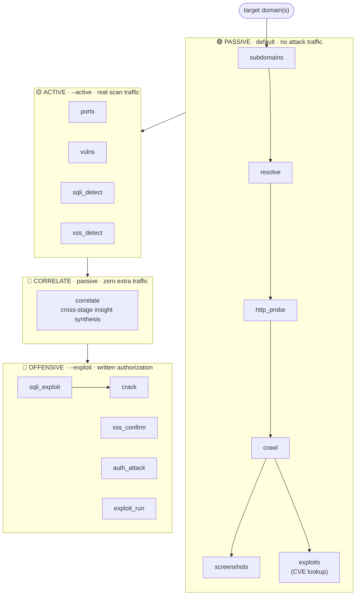
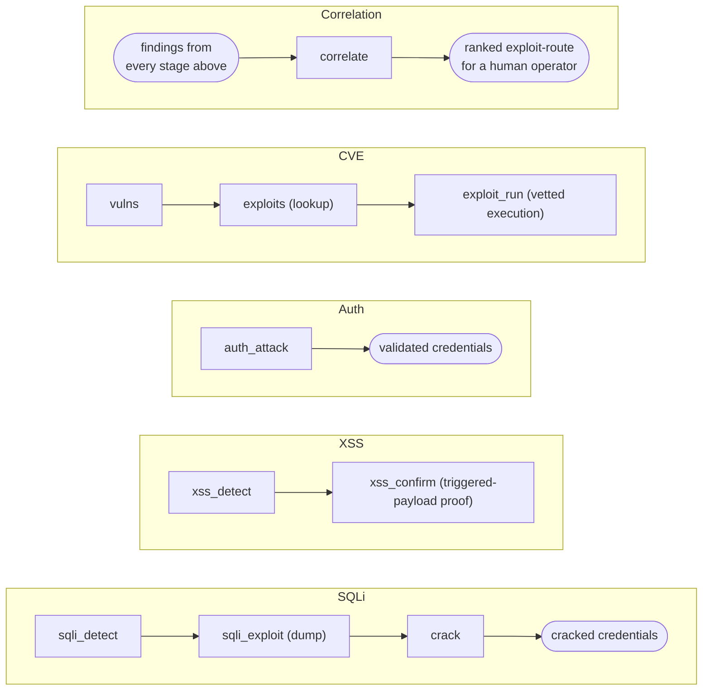

# web-timeline

A staged, **tiered web-application offensive-security pipeline**. Feed it target
domains and it runs passive reconnaissance → active scanning & enumeration →
**exploitation**, producing a normalized JSON dataset and a browsable HTML
report that leads with impact: extracted credentials, dumped data, triggered
payloads, and confirmed CVEs.

It orchestrates best-in-class external tools (ProjectDiscovery suite, sqlmap,
dalfox, hydra, nuclei, John the Ripper) behind one uniform stage interface, a
single typed result model, and a strict **three-tier safety gate**. Use it as
a **CLI** (`recon.py`) or a **local web dashboard** (`serve.py`).

> ⚖️ **Authorized use only.** Run this against systems you own or have explicit
> written permission to test (your lab, an in-scope bug-bounty program, a signed
> engagement). Active and offensive tiers send real attack traffic. You are
> responsible for staying in scope and within the law.

---

## The pipeline, phase by phase



A run has a **tier ceiling**; a stage only executes if its tier is at or below
that ceiling. Higher-tier stages **self-skip** (and say so in the report) —
a passive run can never reach an offensive stage. The gate is enforced in the
pipeline core **and server-side** in the dashboard, not a disabled UI control.

| Tier | Ceiling flag | What it does | Traffic |
|------|--------------|--------------|---------|
| **passive** | *(default)* | OSINT, DNS, HTTP fingerprint, crawl, screenshots, exploit lookup | nothing an IDS would flag as an attack |
| **active** | `--active` | port/vuln scanning, SQLi/XSS **detection** | real scan probes |
| **offensive** | `--exploit` | data extraction, credential attacks, CVE exploitation | real attacks (`--exploit` implies `--active`) |

Any missing tool is detected and its stage is skipped (and noted in the report) —
the pipeline **degrades gracefully** rather than crashing.

---

## Stages, methods & tools

| # | Stage | Tier | Method | Tools |
|---|-------|------|--------|-------|
| 1 | `subdomains` | passive | subdomain discovery via passive sources + certificate transparency | subfinder, assetfinder, amass, crt.sh |
| 2 | `resolve` | passive | DNS resolution; keeps only live hosts, records A/CNAME | dnsx |
| 3 | `ports` | active | fast TCP port scan + service/version detection | naabu, nmap `-sV` |
| 4 | `http_probe` | passive | HTTP(S) probing, fingerprint, TLS/CDN metadata | httpx |
| 5 | `crawl` | passive | active crawl + historical URL harvesting (params for later stages) | katana, waybackurls, gau |
| 6 | `screenshots` | passive | headless screenshots of live endpoints | gowitness |
| 7 | `vulns` | active | templated vulnerability/misconfig scanning | nuclei |
| 8 | `sqli_detect` | active | tests parameterized URLs for SQL injection | sqlmap `--batch --smart` |
| 9 | `xss_detect` | active | tests parameters for reflected/verified XSS | dalfox |
| 10 | `exploits` | passive | maps each CVE → public exploits/PoCs (pointers only) | searchsploit, trickest/cve |
| 11 | `correlate` | passive | cross-references hosts/ports/findings/URLs into chained insights (takeover, exposure, injection-surface, exposed services, shadow-IT, CVE rollups, exploit-routes) — **zero extra traffic** | builtin |
| 12 | `sqli_exploit` | **offensive** | resumes confirmed injections and **extracts data** (bounded) | sqlmap `--dump` |
| 13 | `xss_confirm` | **offensive** | headless-verifies payloads (+ optional blind-XSS callback) | dalfox |
| 14 | `auth_attack` | **offensive** | online password guessing on login surfaces | hydra (http-basic, wp/form) |
| 15 | `exploit_run` | **offensive** | fires vetted CVE templates; resolves matching MSF modules (local search) + stages PoCs | nuclei, msfconsole (+ searchsploit artifacts) |
| 16 | `crack` | **offensive** | extracts hashes from dumps and cracks them | John the Ripper |

### Attack chains that emerge



`correlate` is the odd one out on purpose: it doesn't attack anything, it fuses
*everyone else's* output into compound leads (dangling CNAME, exposed DB port
behind a CDN, a host carrying 5 CVEs at once, ...) so a professional's
eventual, human-driven exploitation pass is faster and better-targeted.

---

## Design

- **Uniform stage contract.** Every stage subclasses `Stage` with a declared
  `name`, `tier`, `tools`, and `depends_on`, and one `execute()` method. The base
  class handles tier gating, tool-availability skips, timing, and bookkeeping.
- **One typed result model.** Stages parse native tool output into shared
  dataclasses (`Host`, `Service`, `HttpEndpoint`, `Finding`, `Exploit`, `Insight`,
  `Credential`, `Secret`, `Loot`) so the aggregator and report never care which
  tool produced a fact.
- **Safe tool boundary.** Every external call is an argument list (never a shell
  string), runs under an enforced per-stage timeout, distinguishes timeout /
  missing-tool / non-zero-exit, and writes an audit trail (`*.cmd`, `*.stdout`,
  `*.stderr`) per stage.
- **Crash-safe.** `results.json` is rewritten after every stage, so a long run is
  inspectable and resumable-by-hand mid-flight.
- **Bounded offense.** Extraction and attack volume are capped by config
  (row limits, URL caps, hash caps); the most destructive actions (sqlmap
  `--os-shell`, blind-XSS callbacks) are **opt-in flags**, off by default.

---

## Setup

```bash
# 1. External tools (Homebrew + go install; sqlmap/dalfox/hydra/john via pkg mgr)
bash scripts/install_tools.sh

# 2. Python deps (use a virtualenv)
python3 -m venv .venv
./.venv/bin/pip install -r requirements.txt

# 3. Confirm what's installed (per-tool availability)
./.venv/bin/python recon.py --list-tools
```

The only Python dependencies are PyYAML, Jinja2 and Flask; all scanning and
exploitation is done by the external CLI tools.

---

## Usage

```bash
# Passive recon (safe default — no attack traffic)
python3 recon.py example.com

# Active tier: scanning + SQLi/XSS detection — authorization required
python3 recon.py example.com --active

# Offensive tier: full exploitation (dump, crack, auth, CVE) — WRITTEN authorization
python3 recon.py example.com --exploit

# Multiple targets, custom config + output dir, unattended (skip prompt)
python3 recon.py -f domains.txt --config config.yaml -o output --exploit --yes
```

Both `--active` and `--exploit` show a typed confirmation prompt (escalated
wording for offensive) unless `--yes` is passed.

### Web dashboard

```bash
./.venv/bin/python serve.py            # http://127.0.0.1:8765
```

Dashboard of past runs · new-scan form (with a **server-enforced** authorization
check for active/offensive) · live streaming stage log (SSE) · in-app report.
Binds to `localhost` and runs Flask's dev server — don't expose it on an
untrusted network (it can launch attacks).

---

## Output

Each run writes to `output/<target>/<timestamp>/`:

```
results.json     # normalized, machine-readable dataset (incl. credentials/loot)
report.html      # styled report; leads with offensive results when present
subdomains/ resolve/ ports/ http_probe/ crawl/ screenshots/ vulns/
sqli_detect/ xss_detect/ exploits/ correlate/ sqli_exploit/ xss_confirm/
auth_attack/ exploit_run/ crack/     # per-stage raw output + command audit trail
```

The report surfaces **credentials**, **extracted loot** (with links to dumped
artifacts), **leaked secrets**, **correlated insights** (with ranked exploit
routes), findings by severity, screenshots, endpoints, services, hosts, and a
per-stage execution log.

---

## Configuration

All behaviour is tunable via [`config.yaml`](config.yaml): tier/stage toggles,
threads, rate limits, port ranges, nuclei severities/tags, crawl depth, per-stage
timeouts, and per-tool knobs — sqlmap level/risk and dump-row cap, dalfox
workers/blind callback, hydra wordlists/form spec, John wordlist, exploit_run
engines, correlate evidence caps. CLI flags (`--active`, `--exploit`, `-o`)
override config.

---

## Limitations & honest caveats

- **Not a replacement for a human tester.** It automates a *methodology*, not
  judgment. Detection stages produce candidates; confirmation stages reduce but
  don't eliminate false positives. Review before you report.
- **Tool-dependent.** Output parsing is best-effort against each tool's current
  schema; a major tool version bump can change output and silently reduce
  coverage until parsers are updated. (Recorded fixtures/parser tests are on the
  roadmap.)
- **`auth_attack` login discovery is heuristic** — reliable for HTTP-basic (401)
  and WordPress; other form logins need an `auth_form` spec. Default wordlists
  are intentionally tiny (point them at real lists for a serious run).
- **`exploit_run` never auto-executes untrusted PoCs by design.** Automated
  exploitation runs only through vetted nuclei templates; GitHub/Exploit-DB PoCs
  and a Metasploit resource script are **staged for manual review**, not
  detonated. Metasploit is used only to *resolve* which local modules match each
  CVE (`msfconsole search`, a local metadata lookup that sends no target
  traffic) — never to fire them. This is a deliberate trust boundary, not an
  oversight.
- **Execution is currently sequential** (a valid topological order). Concurrent
  DAG execution of independent branches is designed (every stage declares
  `depends_on`) but not yet enabled.
- **Scope safety is opt-in, not enforced network-side.** The tiers gate *intent*;
  they do not stop you from pointing it at something you shouldn't. That's on you.

---

## Real-world validation (2026-08-09/10)

Run end-to-end against two authorized public targets to sanity-check the whole
pipeline, not just unit-level logic:

| Target | Authorization | Tier run | Result |
|---|---|---|---|
| `scanme.nmap.org` | Nmap project's official scan target (policy: Nmap-based port scanning only) | passive + ports-only active | 2 hosts, 2 open ports. Clean; nothing to correlate on a bare test box, as expected. |
| `testaspnet.vulnweb.com` | Acunetix's officially-authorized vulnerable test app | full active, then `--exploit` | **9/31 crawled URLs confirmed SQL-injectable** on `Comments.aspx?id=` (boolean-blind + stacked-query + time-blind), backend fingerprinted as Microsoft SQL Server 2014 / IIS 8.5 / ASP.NET. `correlate` rolled the 9 flat findings into **1 ranked exploit-route insight**. `sqli_exploit --dump` then ran and genuinely extracted data — the table itself was empty on every URL tried, a fact about this shared demo app's live data, not a scan failure. |

**Gaps this exposed — worth fixing, not hiding:**
- **`testphp.vulnweb.com` was unreachable during testing.** General internet,
  `scanme.nmap.org`, and other targets were all reachable at the same moment —
  this is that one (extremely popular) shared target being overloaded, not a
  project issue. Every stage needing a live connection degraded gracefully
  (honest zeros, nothing crashed).
- **Time-based blind extraction is slow by nature** — a `WAITFOR DELAY` round
  trip per bit means `sqli_exploit` can take well over an hour per URL against
  this injection class. Bounded by the per-stage timeout, but budget for it.
- **`crawl_urls` has no candidate ranking.** Archive sources (`waybackurls`/
  `gau`) can surface other researchers' old scanner payloads as "URLs," which
  compete unranked against the real application surface for the
  `sqli_max_urls`/`xss_max_urls` caps. Preferring live/`katana`-sourced URLs
  and de-noising payload-shaped ones ahead of the cap is a real, scoped fix —
  tracked below, not yet done.

---

## Roadmap

- **Crawl-candidate ranking** for `sqli_detect`/`xss_detect` (prefer live/
  `katana`-sourced URLs, de-noise payload-shaped archive URLs before applying
  the `_max_urls` caps — see "Real-world validation" above).
- **Surface-wideners:** `osint_harvest`, `js_recon`, `content_discovery`, `param_discovery`.
- **Concurrent DAG execution**, **`--resume`**, run-to-run diffing.
- **Recorded parser fixtures + CI** (ruff/mypy/pytest).
- **Packaging** as an installable console script.

See [`docs/METHODOLOGY.md`](docs/METHODOLOGY.md) for the per-phase methodology,
tool rationale, and detailed limitations.

---

## Layout

```
recon.py                     # CLI entrypoint
serve.py                     # web dashboard entrypoint
config.yaml                  # default configuration
scripts/install_tools.sh     # toolchain installer
pipeline/
  config.py  models.py  runner.py  orchestrator.py  util.py
  stages/    # one module per stage (subdomains … exploit_run, crack)
  report/    # HTML report renderer + Jinja template
  web/       # Flask dashboard (app + templates)
docs/
  METHODOLOGY.md             # phases, methods, tools, limitations (deep dive)
```
