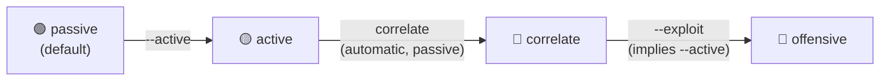
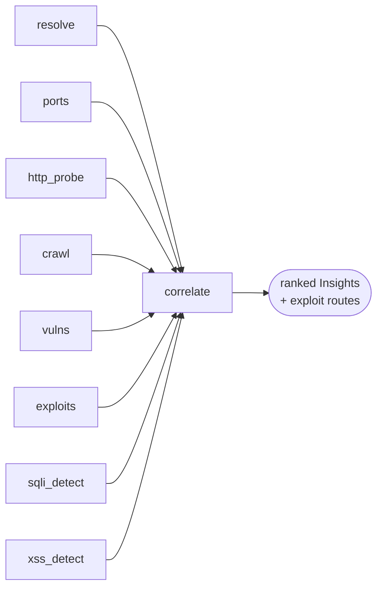
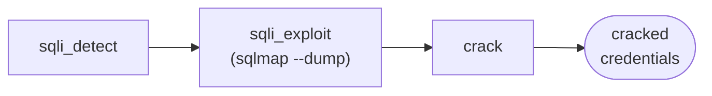

# Methodology

How `web-timeline` maps a web-application penetration-testing workflow onto an
automated, tiered pipeline — the reasoning behind each phase, the tools chosen,
what each stage produces, and where the automation stops being trustworthy.

This document is deliberately honest about limitations. Automated offensive
tooling that overstates its coverage is dangerous; the value is in a repeatable,
auditable methodology, not in pretending to replace a tester.

---

## The tiered model

Web-app testing escalates in intrusiveness: you *look*, then you *probe*, then
you *exploit*. Collapsing those into one "run everything" switch is how people
accidentally attack out-of-scope systems. `web-timeline` makes the escalation
explicit and enforced — gated in the pipeline core (`Stage.run` →
`Config.stage_allowed`), not a UI toggle, a crafted web request, or a
misconfigured template.

There is no way to reach an offensive stage from a passive run — `--exploit`
always implies `--active`.

| Tier | Intent | Reversibility | Gate |
|------|--------|---------------|------|
| **passive** | Understand the target without touching it like an attacker | Fully safe | default |
| **active** | Find weaknesses by probing | Low impact, but detectable/logged | `--active` + confirm |
| **offensive** | Prove impact by exploiting | Can extract data, lock accounts, alter state | `--exploit` + confirm |

---

## Phase 1 — Passive reconnaissance

**Objective:** build a picture of the attack surface using only public data and
standard requests — nothing an intrusion-detection system would flag as an attack.

| Stage | Method | Tools | Produces |
|-------|--------|-------|----------|
| `subdomains` | Passive DNS aggregation + certificate-transparency log mining | subfinder, assetfinder, amass, crt.sh | `Host` list |
| `resolve` | DNS resolution to drop dead names, keep A/CNAME | dnsx | resolved hosts |
| `http_probe` | HTTP(S) fingerprinting: status, title, tech, server, TLS, CDN | httpx | `HttpEndpoint` list |
| `crawl` | Live crawl + historical URL harvesting (the parameter source for injection stages) | katana, waybackurls, gau | `CrawlUrl` list |
| `screenshots` | Headless rendering for fast visual triage | gowitness | endpoint screenshots |
| `exploits` | For each CVE already known, look up public exploits — **pointers only** | searchsploit, trickest/cve | `Exploit` pointers |

- **Why these tools:** ProjectDiscovery suite = fast, scriptable, JSON-emitting
  recon (the de-facto standard). crt.sh needs no API key and surfaces
  subdomains DNS brute-forcing misses. `gau`/`waybackurls` recover historical
  parameterized URLs — the single most valuable input to the SQLi/XSS stages,
  since they reveal parameters the live site no longer links to.
- **Limitations:** only as complete as public data. crt.sh is flaky (degrades
  quietly). `http_probe` is classed passive because a normal GET isn't an
  attack — but it *is* a request to the target; true zero-touch OSINT would
  stop at `subdomains`/`resolve`.

---

## Phase 2 — Active scanning & detection

**Objective:** find weaknesses by probing. Sends real, detectable traffic;
requires `--active`.

| Stage | Method | Tools | Produces |
|-------|--------|-------|----------|
| `ports` | Fast connect-scan, then service/version detection on open ports | naabu, nmap `-sV` | `Service` list |
| `vulns` | Templated vulnerability/misconfiguration/exposure scanning | nuclei | `Finding` list (with CVEs) |
| `sqli_detect` | Test parameterized URLs for SQL injection (detection only) | sqlmap `--batch --smart` | high-severity `Finding` per injectable param |
| `xss_detect` | Test parameters for reflected/verified XSS | dalfox | `Finding` per XSS candidate |

- **Method:** detection stages consume `crawl` output — any URL with a query
  string is a candidate. sqlmap runs per-URL (results map cleanly to the exact
  injection point); dalfox runs in bulk file mode. Both cap URLs tested
  (`sqli_max_urls`, `xss_max_urls`) to bound runtime.
- **Detection vs. exploitation split:** these stages deliberately stop at
  *confirming a parameter is injectable* — extraction/triggering is a
  separate, higher-tier stage. Mirrors how a careful tester works (confirm the
  class first, exploit deliberately second) and keeps the active tier out of
  data extraction.
- **Limitations:** produces candidates, not proof. nuclei coverage depends on
  template freshness. sqlmap `--level`/`--risk` default low (1/1) for speed —
  raise for depth at the cost of time and noise.

---

## Phase 2.5 — Correlation (the pre-exploitation capstone)

**Objective:** every phase above produces *isolated facts* — a host, an open
port, a CVE-tagged finding, a crawled URL. `correlate` is the connective step
a human pentester would do by hand: it re-reads what every earlier stage
already collected and cross-references it, **sending zero additional requests
to the target** — hence `passive` tier despite running after `active`.

Why it exists: the offensive tier is explicitly scoped to vetted, bounded,
automatable actions (Phase 3) — real exploitation stays with an approved
human. The highest-leverage thing automation can do *for that human* isn't
"attack more," it's "make the pre-exploitation picture so complete the
professional's first move is already obvious." Every `Insight` ends with an
explicit human next step; none feed back into an automated action.

| Heuristic | Signal | Inputs crossed |
|---|---|---|
| `subdomain-takeover` | dangling CNAME (no A record) fingerprinted against ~30 claimable third-party services (S3, Heroku, GitHub/Bitbucket Pages, Netlify/Vercel, Shopify, Azure, ...) | `resolve` |
| `sensitive-exposure` | crawled URL paths matching known-sensitive patterns: VCS metadata (`.git/`), env files, backup/archive artifacts, key files, debug/actuator endpoints, admin panels, API schema/introspection endpoints | `crawl` |
| `injection-surface` | query-parameter *names* matching SSRF/open-redirect, LFI/RFI, IDOR, or command-injection sink conventions | `crawl` |
| `exposed-service` | database/management ports (Redis, Mongo, Elasticsearch, Docker API, etcd, ...) directly reachable — escalated to critical when the same host's web traffic is CDN-fronted (origin exposure) | `ports`, `http_probe` |
| `shadow-it` | internal-sounding hostnames (staging/CI/observability/admin tooling) that are nonetheless resolvable/live on the public internet | `resolve`, `http_probe` |
| `vuln-rollup` | hosts carrying ≥2 CVE-tagged findings, rolled into one prioritized target with an exploit-availability tally instead of N flat rows | `vulns`, `exploits` |
| `exploit-route` | per host, ranks confirmed SQLi/XSS, CVEs with a resolved public exploit, and login surfaces into an ordered plan against *this pipeline's own offensive-tier stages* (`sqli_exploit`→`crack`, `xss_confirm`, `exploit_run`, `auth_attack`) | `sqli_detect`, `xss_detect`, `vulns`, `exploits`, `http_probe` |

- **Limitations specific to correlation:** exposure/injection-surface
  heuristics are *lexical* (path/parameter-name matching) — candidates for a
  human to verify, not confirmed exposure; a crawled URL can 404.
  `subdomain-takeover` needs a genuinely dangling CNAME to a fingerprinted
  provider — false positives possible if DNS was captured moments after the
  scan. Each `Insight`'s `confidence` (`low`/`medium`/`high`) reflects this;
  it is not a substitute for the manual step every `next_step` field spells out.
- **Validated on a live target (2026-08-09):** against `testaspnet.vulnweb.com`
  (Acunetix's authorized test app), `exploit-route` correctly rolled 9 flat
  `sqli`-tagged findings on one host into a single ranked plan pointing at
  `sqli_exploit`. See the README's "Real-world validation" section for the
  full run.

---

## Phase 3 — Offensive exploitation

**Objective:** prove impact. Extracts data, guesses credentials, executes
exploits. Requires `--exploit` and written authorization.

| Stage | Method | Tools | Produces |
|-------|--------|-------|----------|
| `sqli_exploit` | Resume confirmed injections, extract data (bounded rows) | sqlmap `--dump` | `Loot` (dumped tables) |
| `xss_confirm` | Headless-verify payloads actually fire; optional blind-XSS callback | dalfox | `Loot` (triggered-payload proof) |
| `auth_attack` | Online password guessing against discovered login surfaces | hydra | validated `Credential`s |
| `exploit_run` | Fire vetted CVE templates; resolve matching MSF modules (local search); stage PoCs for review | nuclei, msfconsole (+ searchsploit) | `Loot` (exploit proof, resolved modules) + staged artifacts |
| `crack` | Extract hashes from dumps, identify type, crack | John the Ripper | cracked `Credential`s |

- **The SQLi → crack chain** is the flagship: `sqli_exploit` reuses sqlmap's
  cached session (no re-detection) to dump tables into CSV; `crack` walks
  those CSVs, heuristically pulls hash-shaped values (bcrypt / MySQL / md5 /
  sha1 / sha256), pairs each with a username-ish column, and feeds John.
  Extraction proves the vulnerability; cracking proves the consequence.
- **`auth_attack` discovery** is heuristic by necessity: HTTP-basic targets
  are any endpoint that answered `401`; WordPress `wp-login.php` has a known
  form spec; other form logins need a user-supplied `auth_form` hydra spec.
  Default wordlists are intentionally tiny — proof-of-concept, not a serious
  brute-forcer until pointed at real lists.
- **`exploit_run` and the untrusted-code boundary — the most important safety
  decision in the project:**
  - Public PoC code (arbitrary GitHub repos) is untrusted: can be backdoored,
    can compromise the *operator's* machine, or damage the target
    unpredictably.
  - So automated exploitation runs **only** through vetted, declarative
    nuclei templates.
  - GitHub/Exploit-DB PoCs and a generated Metasploit resource script are
    **staged for manual review** — fetched/organized, never auto-executed.
  - Metasploit itself is invoked only to *resolve* which local modules match
    each confirmed CVE (`msfconsole search cve:<id>`, a read of the local
    module database that sends no traffic to the target); firing those
    modules stays a manual, operator-driven step.
  - This was a deliberate choice, declined to invert even under a "run
    everything" directive — no competent operator executes unread code
    unattended.
- **Bounded by default:** `sqlmap_dump_max_rows` caps extraction; `--os-shell`
  (OS command execution) and `xss_blind_callback` (out-of-band interaction)
  are opt-in config flags, off by default. Full-capability, not needlessly
  destructive.
- **Validated on a live target (2026-08-09/10):** against
  `testaspnet.vulnweb.com`, `sqli_exploit --dump` ran end-to-end and
  genuinely extracted data (backend: Microsoft SQL Server 2014). Two honest
  findings from that run: time-based blind extraction is inherently slow (a
  `WAITFOR DELAY` round trip per bit — budget well over an hour per URL for
  this injection class), and `crawl_urls` currently has no candidate ranking,
  so archive-sourced payload noise can crowd out real application URLs ahead
  of the `_max_urls` caps (tracked in the README roadmap). See the README's
  "Real-world validation" section for the full run.

---

## Data model

Every stage normalizes native tool output into shared dataclasses, so the report
and aggregator are tool-agnostic:

`Host` · `Service` · `HttpEndpoint` · `CrawlUrl` · `Finding` · `Exploit` ·
`Insight` · `Credential` · `Secret` · `Loot` · `StageRun`

`Credential`, `Secret`, and `Loot` are the offensive-tier spine: cracked/guessed
logins, leaked keys, and references to extracted artifacts. `Insight` is the
correlation-tier spine: ranked, evidence-backed leads with a human next step.
They flow into `results.json` and lead the HTML report.

---

## Known limitations (consolidated)

1. **Parsers track tool schemas.** Best-effort parsing; a major tool version bump
   can silently reduce coverage until updated. Recorded fixtures + parser tests
   are on the roadmap.
2. **Sequential execution.** Stages run in topological order but not yet
   concurrently, though every stage already declares its `depends_on`.
3. **False positives survive detection.** Confirmation stages reduce them; human
   review is still required before reporting.
4. **Login-form coverage is partial** (basic-auth + WordPress + configured specs).
5. **No network-side scope enforcement.** Tiers gate intent, not reachability —
   staying in scope is the operator's responsibility.
6. **Offensive stages need the tools installed and authorization given** — they
   self-skip loudly otherwise, which is a feature, not a bug.
7. **`crawl_urls` has no candidate ranking** — archive-sourced payload noise
   (other researchers' old scanner traffic, picked up by `waybackurls`/`gau`)
   can crowd out real application URLs ahead of the `sqli_max_urls`/
   `xss_max_urls` caps. Confirmed on a live target 2026-08-09; scoped fix
   tracked in the README roadmap.
8. **Time-based blind SQLi extraction is slow by nature** — `sqli_exploit`
   against this injection class can take well over an hour per URL (a
   `WAITFOR DELAY` round trip per extracted bit). Bounded by the per-stage
   timeout, not by anything smarter yet.

---

## Roadmap → maturity

- **Crawl-candidate ranking:** prefer live/`katana`-sourced URLs, de-noise
  payload-shaped archive URLs before applying the `_max_urls` caps.
- **Surface-wideners:** `osint_harvest` (real userlists for `auth_attack`),
  `js_recon` (secrets from JS), `content_discovery` (ffuf), `param_discovery`
  (arjun) — each feeds the existing offensive stages more attack surface.
- **Concurrent DAG execution** of independent branches (deps already declared).
- **`--resume`** (incremental writes already make this cheap) and **run-to-run
  diffing** for recurring authorized monitoring.
- **Recorded fixtures + CI** (ruff / mypy / pytest, offline) so tool-schema drift
  is caught, not absorbed.
- **Packaging** as an installable console script with pinned dependencies and
  recorded external-tool versions per run.
